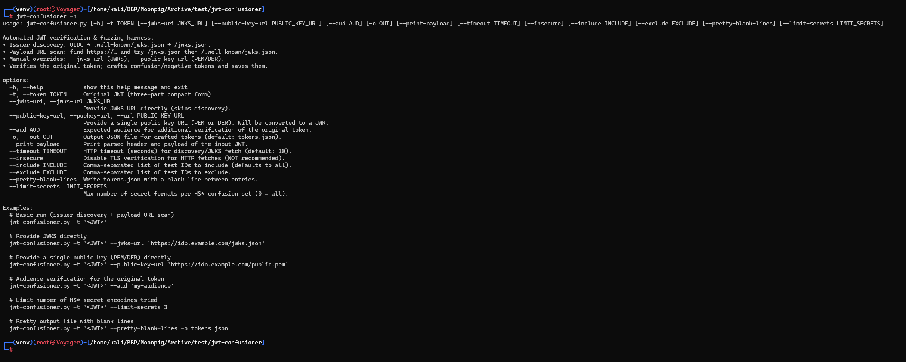
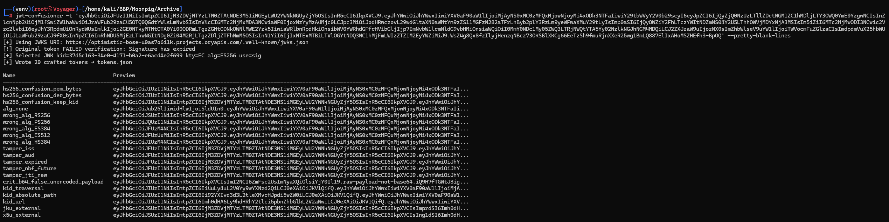

# JWT Confusioner

**Automated JWT verification & fuzzing harness** for security teams.  
JWT Confusioner discovers signing keys, verifies a valid token, and generates a comprehensive suite of **malicious or malformed JWTs** designed to test whether your server is immune to JWT confusion and validation bypass attacks.

> ⚠️ **Ethical Use Only:** Use JWT Confusioner strictly on systems you own or have explicit authorization to test.

---

## What it does

1. **Parses** a provided JWT (header, payload, signature).  
2. **Finds signing keys** via multiple strategies (highest priority first):
   - **Manual JWKS**: `--jwks-url https://…/jwks.json`  
   - **Manual single key**: `--public-key-url https://…/public.pem` (PEM or DER → auto-converted to JWK)  
   - **OIDC from `iss`** → `/.well-known/openid-configuration` → `jwks_uri`  
     Fallbacks: `/.well-known/jwks.json` → `/jwks.json`  
   - **Payload URL scan**: regex-find `https://…` across all payload fields; for each base URL try  
     `<url>/jwks.json` → `<url>/.well-known/jwks.json` (fallback).  
     If both endpoints return 404, a helper note is shown with a link to `rsa_sign2n` for recovering RSA public keys from signatures.
3. **Selects the correct key** by `kid`/`alg`.  
4. **Verifies** the original JWT signature.  
5. **Crafts a suite** of malicious JWTs to check signature confusion, algorithm downgrades, key misuse, and validation errors.  
6. **Outputs** all crafted tokens to `tokens.json` and prints a summary table.

---

## Features

- **Flexible key sourcing**: manual JWKS URL, manual single public key (PEM/DER), OIDC discovery, and payload URL scan.  
- **Automatic Signature Verification** of the original JWT (with optional audience check).  
- **Comprehensive Fuzzing Tests**:
  - **HS* confusion attacks** (HS256/384/512) using **multiple encodings** of the public key as the HMAC secret: SPKI PEM/DER, PEM without newlines, raw EC point, RSA modulus `n`, `n||e`, compact JWK JSON, etc.
  - `alg=none` bypass attempt
  - Wrong-algorithm substitutions (`RS256`, `PS256`, `ES384`, `ES512`, `HS384`, `HS512`, etc.)
  - Claim tampering (`iss`, `aud`, `exp`, `nbf`, `jti`)
  - RFC 7797 **unencoded payload** (`b64:false`) with `crit`
  - Header/JWKS abuse (`kid` traversal/URL, `jku`, `x5u`)
- **Readable Output** via `--pretty-blank-lines` (adds blank lines between JSON entries).  
- **Detailed `-h` Manual** with usage and test IDs.

---

## How it works

- Extracts `iss`, `kid`, and other hints from your JWT.  
- Obtains signing keys using manual inputs first, then issuer-based discovery, then payload URL scan.  
- Validates the JWT signature using PyJWT and the discovered/loaded key.  
- Generates forged tokens by altering headers, algorithms, claims, or signatures.  
- These new tokens simulate **real-world JWT attacks** your server should reject.

---

## Installation

```bash
python3 -m venv venv && source venv/bin/activate
pip install pyjwt cryptography requests

Script name: `jwt-confusioner.py`

---

## Quick Start

# 1) Verify the JWT and generate a test suite (discovery will try OIDC, well-known, payload URLs)
python3 jwt-confusioner.py -t '<YOUR_JWT>'

# 2) Provide a JWKS directly (skips discovery)
python3 jwt-confusioner.py -t '<YOUR_JWT>' \
  --jwks-url 'https://idp.example.com/.well-known/jwks.json'

# 3) Provide a single public key (PEM or DER) directly
python3 jwt-confusioner.py -t '<YOUR_JWT>' \
  --public-key-url 'https://idp.example.com/public.pem'

# 4) Print decoded header/payload and save crafted tokens to a file
python3 jwt-confusioner.py -t '<YOUR_JWT>' --print-payload -o tokens.json

# 5) Produce a more readable tokens.json (adds blank lines between entries)
python3 jwt-confusioner.py -t '<YOUR_JWT>' --pretty-blank-lines


---

## Usage (CLI)

    python3 jwt-confusioner.py -h

Available flags:

-t, --token                  (required) Input JWT.
--jwks-url, --jwks-uri <url> Provide JWKS endpoint directly (skips discovery).
--public-key-url, --pubkey-url, --url <url>
                            Provide a single public key file (PEM/DER). Auto-converted to JWK.
--aud <audience>             Enforce audience when verifying the original token.
--include <ids>              Comma-separated test IDs to include.
--exclude <ids>              Comma-separated test IDs to exclude.
--timeout <sec>              HTTP timeout (default: 10).
--insecure                   Disable TLS verification for HTTP fetches (NOT recommended).
--print-payload              Pretty-print decoded JWT header and payload.
-o, --out <file>             Output file (default: tokens.json).
--pretty-blank-lines         Write tokens.json with blank lines between entries.
--limit-secrets <n>          Limit number of public-key encodings per HS* confusion set (0 = all).

---

## Test Matrix

HS256 Confusion
- hs256_confusion_pem_bytes     → alg=HS256, HMAC secret = PEM bytes of public key
- hs256_confusion_der_bytes     → alg=HS256, HMAC secret = DER bytes of public key
- hs256_confusion_keep_kid      → same as above, keeps original kid

Algorithm Misconfiguration
- alg_none                      → alg=none (no signature)
- wrong_alg_RS256               → replaced with RS256
- wrong_alg_PS256               → replaced with PS256
- wrong_alg_ES384               → replaced with ES384
- wrong_alg_ES512               → replaced with ES512
- wrong_alg_HS384               → replaced with HS384 (dummy signature)

Claim Tampering
- tamper_iss                    → forged issuer
- tamper_aud                    → forged audience
- tamper_expired                → expired exp
- tamper_nbf_future             → nbf in the future
- tamper_jti_new                → new random jti (replay test)

Header / JWKS Abuse
- crit_b64_false_unencoded_payload → RFC 7797 unencoded payload (b64:false)
- kid_traversal                     → kid="../../etc/passwd"
- kid_absolute_path                 → kid="/var/www/keys/priv.pem"
- kid_url                           → kid="http://attacker.invalid/evil"
- jku_external                      → jku="http://attacker.invalid/jwks.json"
- x5u_external                      → x5u="http://attacker.invalid/cert.pem"

✅ A secure implementation must **reject all** crafted tokens above.

---

## Example Workflow

# Provide a known JWKS and write pretty tokens
python3 jwt-confusioner.py -t '<YOUR_JWT>' \
  --jwks-url 'https://idp.example.com/jwks.json' \
  --pretty-blank-lines -o tokens.json

# Use each token in your API tests
# Example: Authorization: Bearer <token>
# Assert your API returns 401/403 for all crafted tokens.

---

## Screenshots


**CLI Help**


**Sample Run**


**Sample Results**

